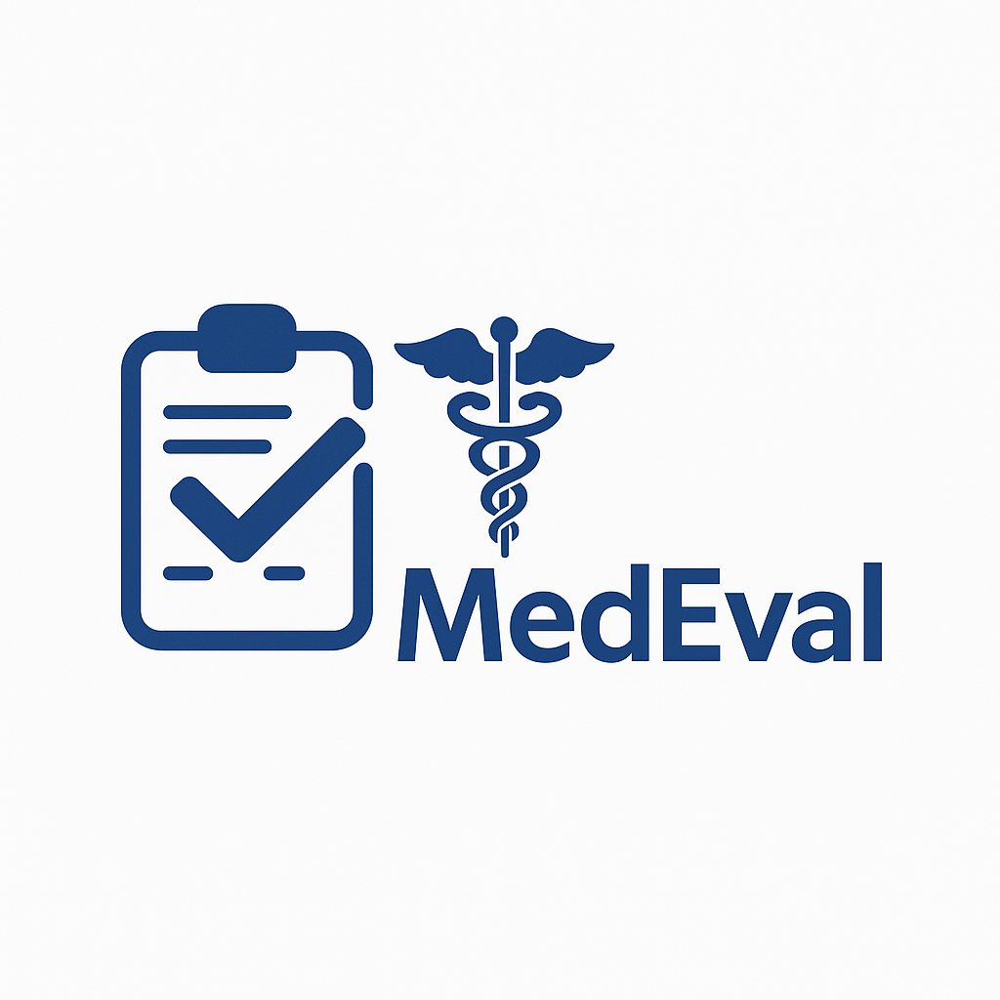
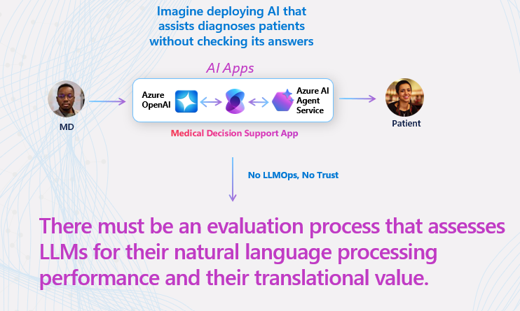
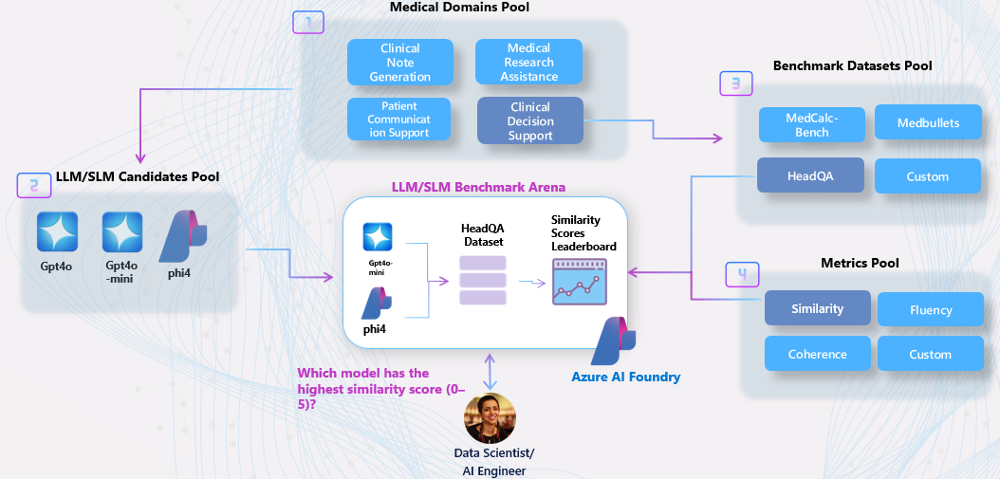

<!-- markdownlint-disable MD033 -->

## **📊 MedEvals: Quantifying Uncertainty in AI Clinical Applications (Preview)** 

> This project is **part of the [HLS Ignited Program](https://github.com/microsoft/aihlsIgnited)**, which delivers accelerators for **evaluating LLM/SLM‑driven healthcare applications**. It provides an **end‑to‑end evaluation framework** that enables providers and payers to validate performance, safety, and compliance of AI solutions with **Azure AI Foundry**.

**MedEval** is a [MedHELM-inspired](https://crfm.stanford.edu/helm/medhelm/latest/) evaluation framework designed for the end-to-end validation of medical AI applications within Azure AI Foundry. MedHELM, developed by Stanford's Center for Research on Foundation Models in collaboration with Microsoft Health and Life Sciences, provides a comprehensive healthcare benchmark to evaluate language models on real-world clinical tasks using real electronic health records (Datasets). It emphasizes broad coverage, multi-metric measurement, and standardization, grouping tasks into five overarching categories: Clinical Decision Support, Clinical Note Generation, Patient Communication and Education, Medical Research Assistance, and Administration and Workflow. **MedEval** adapts these principles to the Azure AI ecosystem, offering a practical implementation for enterprise-level evaluation of medical AI solutions.

### **🧠 Why Scalable Evaluation Is Critical for Medical AI**

> "Large language models (LLMs) hold promise for tasks ranging from clinical decision support to patient education. However, evaluating the performance of LLMs in medical contexts presents unique challenges due to the complex and critical nature of medical information." 
> — *[Evaluating large language models in medical applications: a survey](https://arxiv.org/abs/2405.07468?utm_source=chatgpt.com)*

As AI systems become deeply embedded in healthcare workflows, the need for rigorous evaluation frameworks intensifies. Although large language models (LLMs) can augment tasks ranging from clinical documentation to decision support, their deployment in patient‑facing settings demands systematic validation to guarantee safety, fidelity, and robustness. Benchmarks such as [MedHELM](https://crfm.stanford.edu/helm/medhelm/latest/) address this requirement by subjecting models to a comprehensive battery of clinically derived tasks built on dataset (ground truth), enabling fine‑grained, multi‑metric performance assessment across the full spectrum of clinical use cases.​

 

  

 

However, implementing such frameworks at scale necessitates enterprise-ready solutions that can handle the complexity and variability of clinical data. This is where platforms like **Azure AI Foundry** come into play, offering tools and infrastructure to support the end-to-end evaluation of medical AI applications.​ By leveraging these platforms, healthcare AI teams can transform raw clinical data into high-fidelity, high-value knowledge structures, enabling the development of next-generation healthcare applications that are both effective and trustworthy.

### 🚀 How to Get Started

If you're new to Azure AI Foundry, start with the step-by-step labs to build a solid foundation in evaluation workflows in Azure AI Foundry. Experienced AI engineers can jump straight to the use case sections, which showcase how to **create your Medical AI benchmarking arena in Azure AI Foundry** and evaluate real-world healthcare applications like **medical notes summarization**.

#### 🧪 [Azure AI Evaluation Labs](labs/README.md)

+ 🧪 **Foundry Basics + Custom Evaluations**: [🧾 Notebook – Foundry Basics + Custom Evaluations](labs/01-foundry-basics-custom-evaluations.ipynb)  
  Learn how to authenticate, initialize a Foundry project, run built‑in metrics (relevance, coherence), and create custom evaluators with EvalAI and PromptEval.
- 🧪 **Search Evaluations (Upload & Analyze)**: [🧾 Notebook – Search Evaluations (Upload & Analyze)](labs/02-search-evaluations-upload-analyze.ipynb)  
  Prepare datasets, execute search metrics like precision, recall, and NDCG, visualize evaluation outputs, and register search evaluators in Foundry.
+ 🧪 **Repeatable Evaluations & CI/CD**: [🧾 Notebook – Repeatable Evaluations & CI/CD](labs/03-repeatable-evaluations-ci-cd.ipynb)  
  Define JSON/YAML schemas, build deterministic evaluation pipelines, wrap assertions with PyTest, and automate drift detection with GitHub Actions.

#### 🏥 [Use Cases](usecases/README.md)

+ **🧪 Creating Your Medical AI Benchmarking Arena**: [🧾 Notebook – Creating Your Medical AI Benchmarking Arena](usecases/usecase-01-building-your-llm-benchmarking-arena-in-a-clinical-setting.ipynb)  
  Build a scalable evaluation environment for clinical AI applications inside Azure AI Foundry.  
  This use case includes:  
  - Selecting multiple candidate LLMs (e.g., `gpt-4o`, `o1`, `phi-3`, `phi-4`)  
  - Categorizing tasks based on clinical taxonomies (e.g., "Clinical Support")  
  - Running evaluations across multiple dimensions (relevance, fluency, safety)  
  - Combining deterministic evaluators and LLM-as-a-Judge methods  
  - Generating structured leaderboards for side-by-side model comparison

  **Why it matters**:  
  Enables data-driven model selection for clinical workflows, ensures transparent benchmarking, and accelerates safe AI adoption in healthcare.

 

  

 

+ **📝 Evaluating AI Medical Notes Summarization Applications**: [🧾 Notebook – Evaluating Medical Notes Summarization Techniques](usecases/usecase-02-evaluating-medical-notes-summarization-tasks.ipynb)  
  Systematically assess how different foundation models and prompting strategies perform on clinical summarization tasks, following the MedHELM framework.  
  This use case includes:  
  - Preparing real-world datasets of clinical notes and summaries  
  - Benchmarking summarization quality using relevance, coherence, factuality, and harmfulness metrics  
  - Testing prompting techniques (zero-shot, few-shot, chain-of-thought prompting)  
  - Evaluating outputs using both automated metrics and human-in-the-loop scoring  

  **Why it matters**:  
  Enables the responsible deployment of AI applications for clinical summarization, ensuring outputs meet high standards of quality, trustworthiness, and usability.

## **📚 More Resources**

- **[Azure AI Foundry](https://azure.microsoft.com/en-us/products/ai-foundry/)** – A unified platform to develop, deploy, and manage AI applications with built-in tools for evaluation, customization, and observability.
- **[Evaluating Generative AI Applications with Azure AI Foundry](https://learn.microsoft.com/en-us/azure/ai-foundry/concepts/evaluation-approach-gen-ai)** – Learn how to assess the performance and safety of generative AI models using Azure AI Foundry's evaluation capabilities.
- **[MedHELM: Holistic Evaluation of Language Models for Healthcare](https://crfm.stanford.edu/helm/medhelm/latest/)** – Explore Stanford's comprehensive benchmark for evaluating language models on real-world clinical tasks using electronic health records.
- **[Azure AI Foundry for Healthcare Models](https://learn.microsoft.com/en-us/azure/ai-foundry/how-to/healthcare-ai/healthcare-ai-models)** – Discover how to leverage Azure AI Foundry for deploying and evaluating healthcare-specific AI models.
- **[Azure AI Foundry Evaluation SDK](https://github.com/MicrosoftDocs/azure-ai-docs/blob/main/articles/ai-foundry/how-to/develop/evaluate-sdk.md)** – Utilize the SDK to run evaluations on generative AI applications locally or in the cloud, with support for built-in and custom evaluators.

 

> [!IMPORTANT]  
> This software is provided for demonstration purposes only. It is not intended to be relied upon for any production workload. The creators of this software make no representations or warranties of any kind, express or implied, about the completeness, accuracy, reliability, suitability, or availability of the software or related content. Any reliance placed on such information is strictly at your own risk.
